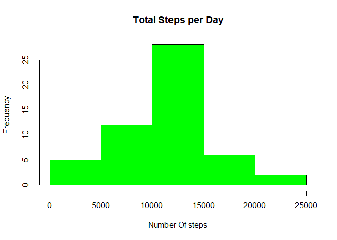

## Loading and preprocessing the data

```r
if (!file.exists('activity.csv')){
  unzip("activity.zip")
}

activity_data <- read.csv("activity.csv",header = TRUE)

# now changing the class of date from character yo Date class

activity_data$date <- as.Date(activity_data$date)

#calculating the total steps taken per day

totalsteps <- tapply(activity_data$steps,activity_data$date,sum)

#mean and median of the total number of steps taken per day 

meansteps <- mean(totalsteps,na.rm = TRUE)
mediansteps <- median(totalsteps,na.rm = TRUE)
```

# Mean of the total number of steps taken per day is 1.0766189\times 10^{4}

# Median of the total number of steps taken per day is 10765


# Plotting a Histogram


```r
hist(totalsteps,xlab = "Number Of steps",main = "Total Steps per Day",col = "green")
```

<!-- -->


## What is the average daily activity pattern?


```r
# Making a Time series Plot of the 5 minute interval and the average number steps taken

library(ggplot2)
meanStepsByInt <- aggregate(steps ~ interval, activity_data, mean)
ggplot(data = meanStepsByInt, aes(x = interval, y = steps)) +
  geom_line() +
  ggtitle("Average Daily Activity Pattern") +
  xlab("5-minute Interval") +
  ylab("Average Number of Steps") +
  theme(plot.title = element_text(hjust = 0.5))
```

<!-- -->

```r
# Which 5-minute interval across all days contain the maximum number of steps

maxInt <- meanStepsByInt[which.max(meanStepsByInt$steps),]
```

# 5-minute interval across all days contain the maximum number of steps :- 835, 206.1698113


## Imputing missing values


```r
# Calculate and report the total number of missing values in the dataset
missingVals <- is.na(activity_data$steps)

# Devise a strategy for filling in all of the missing values

# Create a new dataset that is equal to the original dataset but with 
# the missing data filled in.

imp_activity_data <- transform(activity_data,steps = ifelse(is.na(activity_data$steps),meanStepsByInt$steps[match(activity_data$interval, meanStepsByInt$interval)],activity_data$steps))

# Make a histogram of the total number of steps taken each day and
# and report the mean and median.

impStepsByInt <- aggregate(steps ~ date, imp_activity_data, FUN=sum)
hist(impStepsByInt$steps,main = "Imputed Number of Steps Per Day",xlab = "Number of Steps")
```

<!-- -->

```r
impMeanSteps <- mean(impStepsByInt$steps, na.rm = TRUE)
impMedSteps <- median(impStepsByInt$steps, na.rm = TRUE)
diffMean = impMeanSteps - meansteps
diffMed = impMedSteps - mediansteps
diffTotal = sum(impStepsByInt$steps) - sum(totalsteps)
```


# difference of Mean is 0

# difference of Median is 1.1886792


## Are there differences in activity patterns between weekdays and weekends?


```r
# Create a new factor variable in the dataset with two levels - "weekend" and "weekday"
DayType <- function(date) {
  day <- weekdays(date)
  if (day %in% c('Monday', 'Tuesday', 'Wednesday', 'Thursday', 'Friday'))
      return ("weekeday")
  else if (day %in% c('Saturday', 'Sunday'))
      return ("weekend")
  else
      stop ("Invalid Date Format.")
}
imp_activity_data$date <- as.Date(imp_activity_data$date)
imp_activity_data$day <- sapply(imp_activity_data$date, FUN = DayType)

# Make a panel plot containnig a time-series plot of the 5-minute interval
# and the average number of steps taken across all weekdays or weekends
meanStepsByDay <- aggregate(steps ~ interval + day, imp_activity_data, mean)
ggplot(data = meanStepsByDay, aes(x = interval, y = steps)) + 
  geom_line() +
  facet_grid(day ~ .) +
  ggtitle("Average Daily Activity Pattern") +
  xlab("5-minute Interval") +
  ylab("Average Number of Steps") +
  theme(plot.title = element_text(hjust = 0.5))
```

<!-- -->
